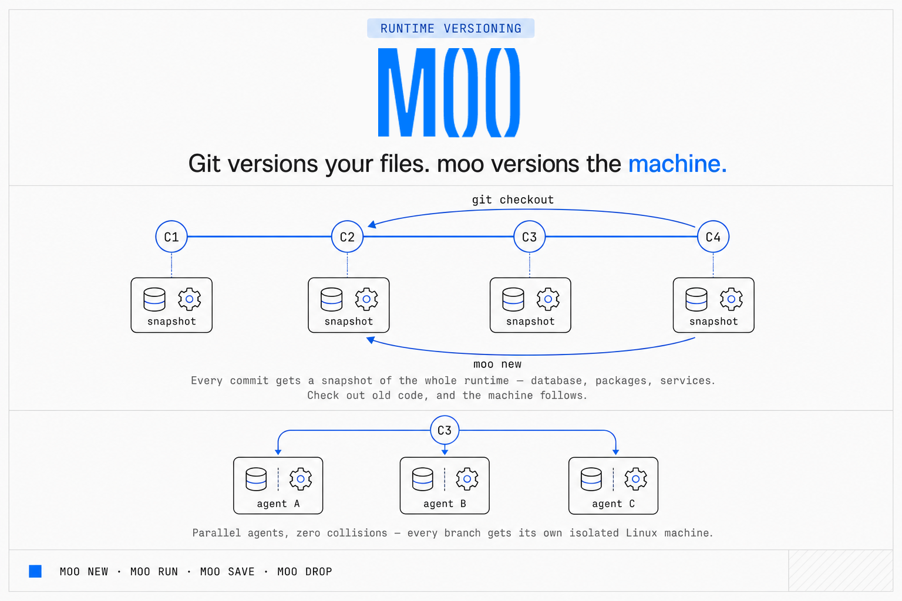

# moo

> **Git versions files. `moo` versions the machine.**



`moo` gives every git branch, worktree, or agent attempt its own
hardware-isolated Linux machine — database, ports, packages, services and
all — with the machine's state **saved per commit and restored by
`git checkout`**.

```
$ moo new feat/billing                       # a machine for this branch
$ moo run feat/billing -- npm run migrate    # migration applied inside it
$ git commit -am "add billing migration"
$ moo save feat/billing                      # runtime snapshot, tagged with the commit

$ git checkout HEAD^                         # rewind the code…
$ moo new feat/billing                       # …and the machine follows.
                                             # the migration is gone; state matches code
```

One noun (the **machine**), four verbs (`new`, `run`, `save`, `drop`).
Everything else composes from those four plus the git you already know.

> **Status: alpha.** `moo` runs on macOS Apple Silicon only (Linux hosts
> planned). Pre-1.0: the CLI surface is stable, but the snapshot format
> may still change between releases.

## Why

Running parallel coding agents against one repo hits the same wall every
time: `git worktree` isolates *files*, but the database, the ports, the
`.env`, the installed packages, and the running services all collide. The
common workaround is a five-tool stack — worktrees + a port-offset script +
`.env` symlinks + a DB-per-branch tool + `docker compose -p` hacks.

`moo` replaces the stack with one motion:

```
$ git worktree add ../app-agent-b -b agent/b
$ moo new agent-b
```

Each machine is a full Linux microVM with copy-on-write state. Six machines
on a 20 GB base cost megabytes and fork in under a second. And unlike any
sandbox, the machine's state is a **versioned artifact of the repo**:
`git bisect` can boot the exact runtime — migrations, seeds, packages —
that existed at every commit it probes.

## Install

Requirements checked before anything is installed: an Apple Silicon Mac
and [Homebrew](https://brew.sh). No root, no daemon, nothing runs in the
background except your machines.

```bash
curl -fsSL https://github.com/heyito/moo/releases/latest/download/install.sh | sh
```

The installer brew-installs the isolation runtime and filesystem tools,
downloads the prebuilt binary for the release, signs it, installs it to
`/opt/homebrew/bin/moo`, and finishes with `moo doctor` — exit code 0
and four green checks mean you're ready. Verify end to end with one
machine (prints `ok`):

```bash
moo new smoke && moo run smoke -- echo ok && moo drop smoke --force
```

### From source

Additionally requires [Rust](https://rustup.rs):

```bash
git clone https://github.com/heyito/moo && cd moo
scripts/install.sh
```

Same result: deps via Homebrew, then a local build is signed, installed,
and checked with `moo doctor`. Both installers are non-interactive and
safe to run from a coding agent; see [AGENTS.md](AGENTS.md).

## Onboard a project

Two steps, once per repository.

**1. Install the agent skills.** Four skills teach a coding agent the
full workflow — machine-per-branch coding, golden-image setup, browser
desktops, and verifying changes. From the repository root:

```bash
mkdir -p .claude/skills && curl -fsSL https://github.com/heyito/moo/archive/main.tar.gz \
    | tar -xz -C .claude/skills --strip-components=2 '*/skills'
```

That is the Claude Code project location; for Cursor use `.cursor/skills`
as the destination, or the home-directory equivalents (`~/.claude/skills`,
`~/.cursor/skills`) to install them once for every project.

**2. Build the golden image and baseline machine.** Ask your agent to
"set up moo for this project" — the `moo-golden-image` skill walks it
through everything below — or do it by hand:

```bash
moo new base                     # first use builds the project's golden image
curl -fsSL https://github.com/heyito/moo/releases/latest/download/agent-base.sh \
    | bash -s -- base            # optional: compilers, Node.js, Chromium
moo run base -- '<install your runtime: packages, database, services>'
moo save base                    # the baseline everyone forks
```

From here every branch, worktree, or agent attempt starts fully
provisioned in under a second: `moo new feat/x from base`.

## The four verbs

```
moo new <name> [from <src>] [--detached]   create or restore a machine
moo run <name> -- <cmd> [args...]          execute inside the machine
moo save [<name>]                          snapshot state, tagged with the current commit
moo drop <name> [--force] [--snapshots]    destroy the machine (snapshots survive)
```

- **`new`** is idempotent, like `git checkout`. If a snapshot exists for the
  commit the handle shadows, it boots that snapshot; otherwise it boots the
  current live state; otherwise it creates a fresh machine from the base
  image. `<src>` can be a git ref or SHA, a snapshot ID, or another
  machine's name (sub-second copy-on-write fork).
- **`run`** has `docker exec` semantics: services you start keep running
  between invocations. Exit codes and output round-trip faithfully.
- **The working tree follows you automatically.** `new` and `run`, invoked
  from inside the machine's repository, sync your working tree — tracked
  files plus untracked-unignored files, exactly what `git status` calls
  your work — into the machine at `/srv/app` (configurable via
  `[project] workdir`). Unchanged trees are skipped in milliseconds.
  Gitignored files are never pushed and never deleted, so `node_modules`,
  build output, and the machine's own `.env` survive every sync. The host
  tree is authoritative: files you delete or switch away from on the host
  disappear in the machine too.
- **`save`** is `git commit` for the runtime. Idempotent — same commit,
  same content, same snapshot. Byte-identical states share storage.
- **`drop`** destroys the live machine. Saved snapshots survive unless you
  pass `--snapshots`.

Admin, read-only: `moo ls` (machines, ports, snapshots), `moo open <name>
[guest-port] [/path]` (print and open the host URL for a forwarded guest
port in the browser — the port is optional when the machine forwards
exactly one), `moo doctor` (host checks).

```
$ moo open feat/billing 3000            # -> http://localhost:24817/
$ moo open desktop 6901 '/vnc.html?autoconnect=true'
```

## A clickable desktop (optional)

Machines are headless, but they are full Linux systems — a desktop is
just packages plus a port. With `ports = [6901]` in `moo.toml`:

```
$ scripts/desktop.sh my-machine
```

Installed from a release with no checkout? The provisioning scripts are
attached to every release — run them from inside your project:

```
$ curl -fsSL https://github.com/heyito/moo/releases/latest/download/desktop.sh | bash -s -- my-machine
```

installs XFCE + VNC + a browser client inside the machine, starts it on
every boot, saves a snapshot, and prints a `localhost` URL you can click
around in. Reopen it any time with:

```
$ moo open my-machine 6901 '/vnc.html?autoconnect=true&resize=scale'
```

The desktop is part of the machine's state: forks of the
machine get their own desktop on their own port, and `moo new` after a
`git checkout` boots the desktop exactly as it was at that commit.

Similarly, `scripts/agent-base.sh` provisions a machine with the common
agent toolkit — compilers, developer CLIs, database clients, Node.js,
and a headless-capable Chromium — and snapshots it, so
`moo new agent-1 from base` forks a fully equipped machine in under a
second. Run both scripts against the same machine and the desktop gets
a working browser.

## Restore semantics — read this once

`moo new <name>` on an existing handle **prefers the snapshot saved for the
current commit** over the live overlay. That is the whole point — the
runtime follows the code — but it means unsaved runtime work is replaced
when you switch commits. The rule of thumb is the same as git's:
**`moo save` before you `git checkout`**, the way you `git commit` before
you switch branches. A shell alias makes it automatic:

```sh
gitcommit() { git commit "$@" && moo save; }
```

## Configuration (`moo.toml`, optional)

Committed to the repo if used. This is the whole schema — there are no
service graphs, health checks, or volumes:

```toml
[project]
base = "debian:bookworm"     # any OCI image reference
workdir = "/srv/app"         # where the working tree is synced in the guest

[recipe]
lockfiles = ["package-lock.json"]   # participate in the base image identity

[resources]
cpus = 2
memory = "4GiB"

[network]
ports = [5432, 3000]         # guest ports; each gets a stable host port (moo ls shows the map)

[quiesce]
commands = [                 # run inside the guest before every save
  "su postgres -c 'psql -c CHECKPOINT'",
]
```

The base image is built automatically on first use — layers are fetched
straight from the registry (no Docker daemon needed) and assembled into a
bootable disk, unprivileged. Machines with the same base + lockfiles share
one image.

## What it's for

- **Time travel.** `git checkout <old-sha>` + `moo new <name>` boots the
  exact runtime that existed at that commit.
- **Runtime-dependent bisects.** Bugs that only reproduce against a
  specific migration state become bisectable:

```
$ git bisect start bad-sha good-sha
$ git bisect run bash -c 'moo new probe && moo run probe -- npm test'
```

- **Parallel agents, zero collisions.** Machines isolate the runtime;
  `git worktree` isolates the files. Every parallel attempt gets one of
  each — its own checkout *and* its own DB, ports, packages, services:

```
$ for name in a b c; do
    git worktree add ../app-agent-$name -b agent/$name
    (cd ../app-agent-$name && moo new agent-$name from base)
  done
```

  Never point two sessions at the same checkout — the working tree is
  host-owned and authoritative, so they would overwrite each other's
  files no matter how many machines they have.

- **Fork-and-promote.** Fork a machine, let an agent work, `git merge` the
  winner, `moo drop` the losers and remove their worktrees.

## Contracts and limitations

- **Machines belong to their repository.** Handles are scoped to the
  repository a machine was created from: `moo new base` in two different
  repositories creates two independent machines, and every verb resolves
  names against the repository you run it in. All worktrees of a
  repository share its machines — `moo new feat/x from base` works from
  a fresh worktree — and each worktree syncs its own files. `moo ls`
  lists all machines on the host with their repository. Golden images
  are still shared across repositories by recipe content.
- **Durability.** A live machine's disk survives machine shutdown, not
  host power loss. Snapshots are flushed to physical disk and survive
  power loss.
- **Network isolation.** Every machine has a fully private network stack.
  `localhost` inside the machine is the machine's own loopback — never the
  host's. Host services are not reachable from the guest's loopback, and
  two machines never share network state.
- **Ports.** Guest TCP services listed in `[network] ports` are reachable
  on host localhost at the port shown by `moo ls`. Like containers, a
  service must listen on a non-loopback address (`0.0.0.0`) to be
  reachable from the host. TCP half-close is not proxied faithfully —
  plain request/response protocols (HTTP etc.) are unaffected.
- **Platform.** macOS Apple Silicon hosts, Linux guests (arm64). Linux
  host support is planned.
- `git reset --hard` and `git rebase` move HEAD without any hook — the
  machine doesn't auto-follow; run `moo new <name>` afterwards.

## See it work

Three self-contained, self-verifying demos (each cleans up after itself):

```
$ scripts/demo-timetravel.sh   # runtime follows git checkout, survives drop
$ scripts/demo-parallel.sh     # 3 machines, same guest port, zero collisions
$ scripts/demo-bisect.sh       # git bisect finds a bug that only exists in a
                               # specific migration state — unattended
```

## Working with coding agents

`moo` is built for agent workflows: [AGENTS.md](AGENTS.md) is a terse
machine-readable reference (install, verbs, rules), and
[skills/moo-code/SKILL.md](skills/moo-code/SKILL.md) is an installable
skill for Claude Code / Cursor that teaches an agent the full workflow —
isolated machines per branch, save at commit boundaries, fork-and-promote.

## Development

```
$ cargo build --release             # builds the CLI + embedded guest agent
$ scripts/leakcheck.sh              # gate: no backend names in user output
```

The isolation backend is an implementation detail and never appears in
user-facing output; `scripts/leakcheck.sh` enforces this in CI. See
[CONTRIBUTING.md](CONTRIBUTING.md) for the demo suite that gates PRs.

## License

[MIT](LICENSE)
